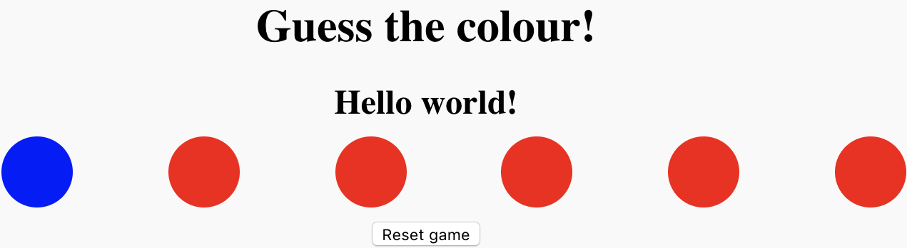

## Change all the buttons

Now one button is changing colour at random, but you want all six buttons to change. Luckily, you don't have to write out your code six times, because you can use a **loop**!

A `for` loop does something a particular number of times. You will write your loop so that it assigns each button in the `buttons` array a random colour, without you having to worry about how many buttons there are. That means you could add another three buttons, or another thousand, and you wouldn't need to change the code!

--- task ---

Put a `for` loop around the code that changes the colour of a button. Use the **loop variable** `i` to pick which element of the `buttons` array to change.
```JavaScript
for (var i = 0; i < buttons.length; i++) {

  var red = makeColourValue();
  var green = makeColourValue();
  var blue = makeColourValue();
  
  setButtonColour(buttons[i], red, green, blue);

}
```

--- /task ---
Reload the page a few times and watch all the buttons change colour. 



The loop changes the buttons' colours one by one — one change for every time the loop runs. But you can't actually see the colours change one by one, because the loop runs very fast!

--- collapse ---
---
title: How the for loop works
---
A `for` loop always has four parts:

1. The loop variable (commonly called `i` because it is an **i**nteger). In your code, this variable gets created with the `var i = 0;` piece of the loop code. The loop variable is used to count the number of times the loop has run, and to determine how many times the loop runs in total.
1. The test, which decides whether or not to run the code inside the loop brackets `{}`. The test checks a **condition**, for example, 'Is the loop variable 5 or larger?'. If the test is successful, the code inside the loop runs, and then the program comes back to the test again. If the test is not successful, then all of the remaining loop is skipped over and the program continues. In your loop, the test asks 'Is the loop variable smaller than the number of items in the `buttons` array?'. That's the `i < buttons.length;` part of the loop code, where the `buttons.length` property tells your how many items are in `buttons`. 
1. The actual code that the loop runs, contained inside the brackets `{}`. This code can be anything you want, and it has access to the current value of the loop variable. Using the loop variable, your loop 'loops over' the `buttons` array, so every time it runs, it performs an action on a different button in the array.
1. A little piece of code that runs once the loop has successfully run one time. In JavaScript `for` loops, this piece of code is at the top of the loop, the last piece inside the parentheses `()`. Most commmonly, this piece of code simply adds `1` to the loop variable to mark the loop's progress. That's exactly what the piece of code does in your loop: `i++` is just a short version for `i = i + 1`.
--- /collapse ---
