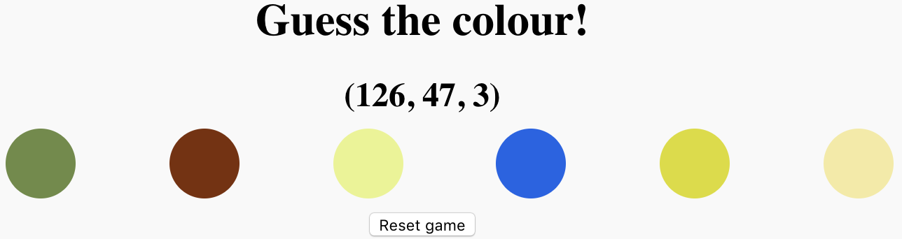

## Pick and check the answer

Your game now picks random colours every time it reloads. Next, you need to pick one colour to be the winning answer and make it so that, when the player clicks on the correct button, they get told that they've won.

To do this you need to:

 - Pick one of the random colours as the correct answer
 - Display the RGB colour values of that colour to the player
 - Make sure that when the player clicks on the winning button, a message tells them that they have won

The easiest way do the first two things is to pick a random __button__ as the correct answer, and to display its colour values.

First, pick a button.

--- task ---
You already know how to pick a number at random, so now pick a number that describes the position of an item in the `buttons` array.

Add this code just above your `for` loop:

```JavaScript
var answerButton = Math.round(Math.random() * (buttons.length - 1));
```

This line creates a variable called `answerButton` that stores the random number.
--- /task ---

Next, you need to display the RGB colour values of that button.

These three values get created in the `for` loop runs that sets the button's colour, so that's the right time to get your code to display the values. And you need to make sure that the colour values only get displayed if the button the `for` loop is looping over is at position `answerButton` in the `buttons` array. To do that, you use an **`if` statement**.

An `if` statement is a bit of code that tests a particular condition, and if the test is successful, the code inside the `if` statement runs. Like in a `for` loop, the code inside an `if` statement is in braces (`{}`) following the condition.

--- task ---
First, **delete** the line of code you wrote earlier to update the web page heading with your hello message. You're going to need to display the colour values in the heading!
--- /task ---

--- task ---
Then update your `for` loop to add an `if` statement that checks if the loop is working with the `answerButton`. If yes, then the `if` statement should display the colour values as the page heading.

It should look like this:

```JavaScript
for (var i = 0; i < buttons.length; i++) {

  var red = makeColourValue();
  var green = makeColourValue();
  var blue = makeColourValue();

  setButtonColour(buttons[i], red, green, blue);

  if (i === answerButton) {
    heading.innerHTML = `(${red}, ${green}, ${blue})`;
  }
}
```
Notice that you can use `${red}` to include the value of the `red` variable inside your text string, and that the same is true for the other colour value variables.
--- /task ---

Now you need to add code so that your game knows which button the player clicks and displays a message in response.

The first thing to do is selecting the element on the web page where the message will show.

--- task ---
Above your `for` loop, create a variable called `answerMessage` to store the element on the web page that has an `id` of `answer` (one of the headings has this `id`). Use this code to do that:

```JavaScript
var answerMessage = document.getElementById('answer');
```
--- /task ---
Next, each button needs an **event listener**. Event listeners are pieces of code that let your game wait for an action the player takes and then do something in response. You want your game to know if the player clicks a button, so the event listeners you need are going to wait for clicks.

--- task ---

Inside the `for` loop, insert the following code to add a listener for clicks to each button, and to give the listener a function to run when a click happens.

The function includes a few things:
 - An `if` statement, which you already understand, although this statement includes an `else` part that runs only if the test of the condition is unsuccessful
 - `innerHTML` updates the text of the web page element stored in `answerMessage`
 - The special `this` keyword, which means, in this case, 'the button that was clicked'

```JavaScript
buttons[i].addEventListener('click', function(){
        if (this === buttons[answerButton]) {
            answerMessage.innerHTML = "Correct!";
        } else {
            answerMessage.innerHTML = "Wrong answer! Guess again!";
        }
    });
```
--- /task ---

--- collapse ---
---
title: What your code should look like now
---
Look at the following code to see how everything in the `script.js` program fits together:

```JavaScript
function makeColourValue() {
  return Math.round(Math.random() * 255);
}

function setButtonColour(button, red, green, blue) {
  button.setAttribute('style',
    'background-color: rgb(' + red + ',' + green + ',' + blue + ');'
  );
}


var buttons = document.getElementsByClassName('colourButton');

var heading = document.getElementById('colourValue');

var answerMessage = document.getElementById('answer');
  
var answerButton = Math.round(Math.random() * (buttons.length - 1));

  
for (var i = 0; i < buttons.length; i++) {

var red = makeColourValue();
var green = makeColourValue();
var blue = makeColourValue();

setButtonColour(buttons[i], red, green, blue);

if (i === answerButton) {
    heading.innerHTML =`(${red}, ${green}, ${blue})`;;
}

buttons[i].addEventListener('click', function(){
    if (this === buttons[answerButton]) {
        answerMessage.innerHTML = "Correct!";
    } else {
        answerMessage.innerHTML = "Wrong answer! Guess again!";
    }
});

}
```


Your game should look like this now:



--- /collapse ---

Reload the web page and play your game! At the moment, you have to reload the page every time you want to play a new round.